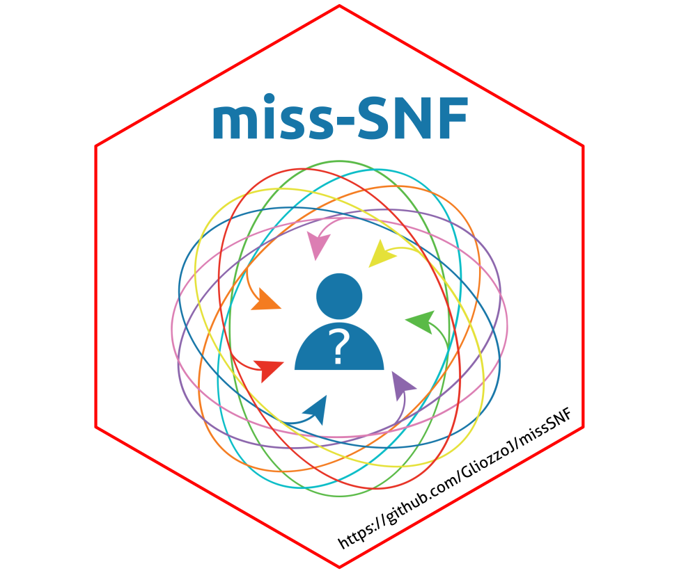

# A multimodal patient similarity network integration approach to handle completely missing data sources

Precision medicine leverages patient-specific data to improve prevention, diagnosis, prognosis and treatment of diseases. Advancing precision medicine requires the non-trivial integration of complex, heterogeneous and potentially high-dimensional data sources, such as multi-omics and clinical data. However, these datasets are frequently incomplete, with one or more sources missing for subsets of patients. Although data fusion approaches handling entirely missing sources showed their promise, their applicability remains limited, as they are typically designed and/or evaluated solely for clustering or classification tasks.

We propose miss-SNF, a novel general-purpose data integration approach designed to fuse incomplete datasets while partially reconstructing missing pairwise similarities. 
miss-SNF integrates incomplete unimodal patient similarity networks by leveraging the non-linear message-passing strategy of Similarity Network Fusion. The resulting integrated network can be utilized for both clustering and classification tasks. We evaluated miss-SNF on nine cancer datasets from The Cancer Genome Atlas and compared it to representative state-of-the art integration approaches. It showed superior performance in recovering similarities and achieved competitive clustering results, identifying patients subgroups enriched in clinically relevant variables and showing differential survival. Moreover, we effectively used the fused network to predict clinical outcomes of medical interest.

<div align="center">

</div>

## Installation

The "miss-SNF" package can be installed using devtools. Please
follow these steps:

0. Download or clone miss-SNF package from this repository.

```
# Code to clone repository
git clone https://github.com/AnacletoLAB/missSNF.git
```

You can download the compressed _.zip_ file containing this repository using the "< > Code" button (decompress the folder before installation).

1. Install devtools using:

```
install.packages("devtools");
```

2. Load devtools package:

```
library("devtools");
```

3. Then, you can install miss-SNF (some Bioconductor packages
has to be installed apart):

```
# Install BiocManager
if (!require("BiocManager", quietly = TRUE))
    install.packages("BiocManager")

# Install Bioconductor dependencies
BiocManager::install("RBGL")
BiocManager::install("graph")
BiocManager::install("limma")

# Install miss-SNF
install("./missSNF");
```

4. Now miss-SNF can be used as every R package:

```
# Load package
library(missSNF);

# View documentation
?miss.snf()
```

## Additional options

miss-SNF implementation can impute missing values using simple strategies (i.e. mean or median imputation). Moreover, you can leverage the p-step Random Walk Kernel[^2][^3] to compute the "global" similarity matrix $P$ and/or 1-step Random Walk Kernel to compute the "local" similarity matrix $S$ of the algorithm. 

These options were not tested in the experiments presented in the submitted paper [^1].

## References
[^1]: Jessica Gliozzo, Mauricio A. Soto Gomez, Arturo Bonometti, Alex Patak, Elena Casiraghi and Giorgio Valentini. "A multimodal patient similarity network integration approach to handle completely missing data sources" npj Digital Medicine **[Submitted]**

[^2]: Smola, Alexander J., and Risi Kondor. "Kernels and regularization on graphs." Learning Theory and Kernel Machines: 16th Annual Conference on Learning Theory and 7th Kernel Workshop, COLT/Kernel 2003, Washington, DC, USA, August 24-27, 2003. Proceedings. Berlin, Heidelberg: Springer Berlin Heidelberg, 2003.

[^3]: Re, Matteo, Marco Mesiti, and Giorgio Valentini. "A fast ranking algorithm for predicting gene functions in biomolecular networks." IEEE/ACM Transactions on Computational Biology and Bioinformatics 9.6 (2012): 1812-1818.

